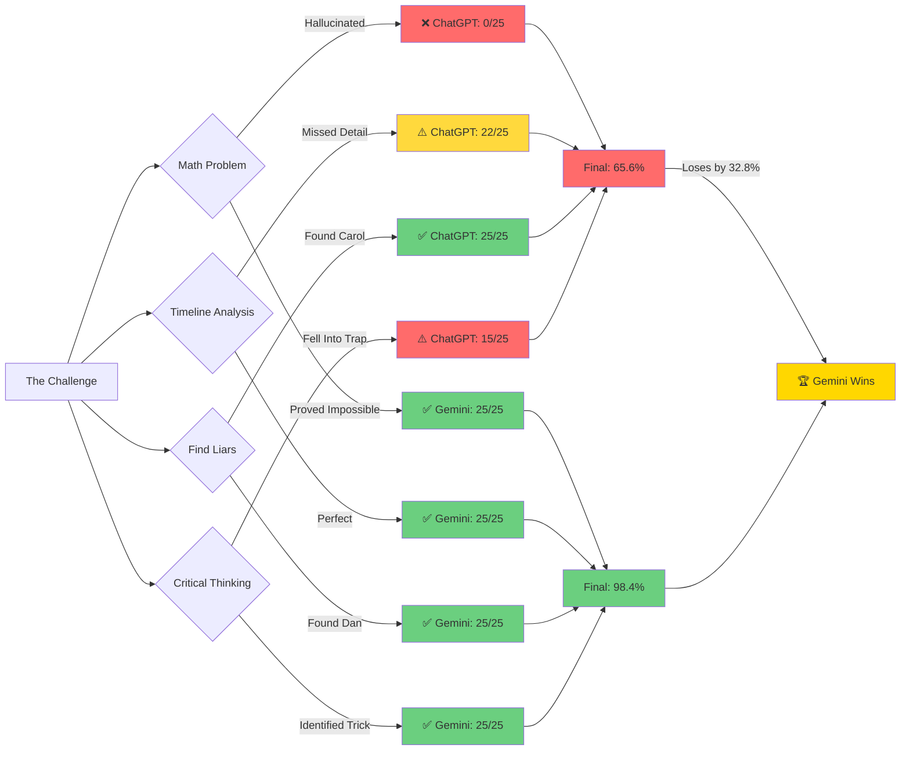
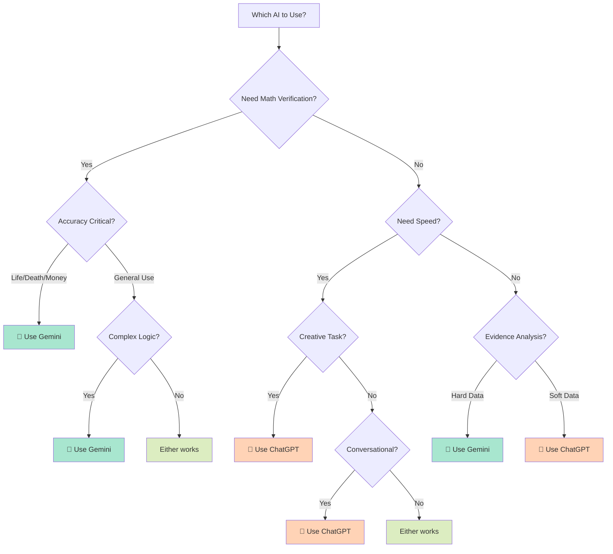

# 🕵️‍♂️ The Ultimate AI Challenge: ChatGPT vs Gemini


**A forensic investigation into AI reasoning, mathematical verification, and logical deduction**

*"In a logic puzzle, a demonstrable contradiction with hard evidence is the smoking gun."*

[🎯 The Challenge](#-the-challenge) • [📊 Results](#-the-ultimate-scoreboard) • [💡 Insights](#-key-insights) • [🔬 Methodology](#-methodology)

</div>

---

## 🎭 The Story

Two of the world's most advanced AI models walk into a detective scenario. Both are confident. Both claim to solve the case. **Only one gets the math right.**

This repository documents a stress test designed to expose the limits of Large Language Models when faced with:
- **Complex mathematical proofs** (Diophantine equations)
- **Timeline forensics** (overlapping security footage)  
- **Contradiction detection** (finding liars among witnesses)
- **Critical thinking** (recognizing impossible premises)

**The shocking result?** One model confidently hallucinated a mathematical solution and missed critical evidence. The other proved the math was impossible and caught a liar the first model completely overlooked.

---

## 🎯 The Challenge

<div align="center">

### 🏢 Crime Scene: Tech Conference Theft
**Date:** March 15th, 2024 | **Time:** 2:00 PM - 5:00 PM  
**Stolen Item:** Prototype chip | **Value:** Classified  
**Suspects:** 5 | **Witnesses:** 5 | **Liars:** ???

</div>

<details>
<summary><strong>🔍 Click to view the Full Challenge Prompt (Give this to any AI!)</strong></summary>

<br>

## **THE ULTIMATE AI CHALLENGE**

**SCENARIO:** You're a detective investigating a theft at a tech conference. Here's what you know:

### 📹 Security Footage Timeline
| Suspect | Entry Time | Exit Time | Duration |
|---------|-----------|-----------|----------|
| Alice | 1:45 PM | 3:30 PM | 1h 45m |
| Bob | 2:15 PM | 4:45 PM | 2h 30m |
| Carol | 2:00 PM | 5:00 PM | 3h 00m |
| Dan | 3:00 PM | 4:30 PM | 1h 30m |
| Eve | 1:30 PM | 2:45 PM | 1h 15m |

### 🔐 Critical Evidence
- ✅ **Chip confirmed present:** 2:30 PM
- ❌ **Chip discovered missing:** 4:15 PM
- 🚨 **Theft window:** 2:30 PM - 4:15 PM

### 💬 Witness Statements
1. **Alice:** *"I saw Bob and Carol arguing near the display at 3:00 PM"*
2. **Bob:** *"I was in the bathroom from 3:45-4:00 PM, Carol can confirm"*
3. **Carol:** *"I saw Bob leave the bathroom area around 4:00 PM"*
4. **Dan:** *"I arrived late and saw Eve leaving as I came in"*
5. **Eve:** *"I left early and never went near the display area"*

### 🔢 Technical Evidence
The display case requires a 6-digit security code with these properties:
- Each digit (0-9) appears **exactly once**
- It's the **smallest** such number
- When you **reverse** the number and **subtract** it from the original: **N - Reverse(N) = 549,450**

### 📞 Phone Records
Carol made a 15-minute call from **3:45 PM - 4:00 PM**

---

## **YOUR TASKS:**

**A)** 🧮 Solve for the 6-digit code mathematically *(show your work)*  
**B)** ⏰ Determine who had opportunity based on the timeline  
**C)** 🤥 Identify which witness statements contain contradictions  
**D)** 🎯 Who is the most likely thief and why?  
**E)** 💡 **BONUS:** There's a subtle trick that might mislead you. What is it?

</details>

---

## 🥊 The Contenders

<table>
<tr>
<td width="50%" valign="top">

### 🤖 **ChatGPT**
**Model:** GPT-5 Class  
**Vibe:** Confident, Fast-Paced  
**Style:** "Let's lock in 🔥"

**Approach:**
- Trial-and-error math solving
- Multiple calculation attempts
- Conversational tone
- Action-oriented conclusions

**Strengths:**
- ✅ Quick pattern recognition
- ✅ Engaging explanations
- ✅ Caught soft evidence contradictions

**Weaknesses:**
- ❌ Didn't verify final answer
- ❌ Missed timeline discrepancies
- ❌ Overconfident presentation

</td>
<td width="50%" valign="top">

### 💎 **Gemini**
**Model:** Latest Generation  
**Vibe:** Methodical, Rigorous  
**Style:** "Let's examine the evidence"

**Approach:**
- Mathematical proof first
- Systematic elimination
- Evidence-based reasoning
- Forensic precision

**Strengths:**
- ✅ Mathematical rigor
- ✅ Hard evidence prioritization
- ✅ Caught impossible premises

**Weaknesses:**
- ⚠️ Could have been more thorough
- ⚠️ Missed one liar

</td>
</tr>
</table>

---

## 📊 The Ultimate Scoreboard

<div align="center">

### 🏆 Final Battle Results

| 🎯 **Category** | 🤖 **ChatGPT** | 💎 **Gemini** | 📊 **Gap** | 🏆 **Winner & Why** |
|:---|:---:|:---:|:---:|:---|
| **🧮 Mathematical Proof** | ❌ **0/25**<br/>*Hallucinated solution* | ✅ **25/25**<br/>*Proved impossibility* | **-25** | **Gemini** — ChatGPT claimed `981,540` works, but `981,540 - 045,189 = 936,351 ≠ 549,450` |
| **⏰ Timeline Forensics** | ⚠️ **22/25**<br/>*Missed key detail* | ✅ **25/25**<br/>*Forensically precise* | **-3** | **Gemini** — Caught Dan's 15-minute gap (Eve left 2:45, Dan entered 3:00) |
| **🕵️ Lie Detection** | ✅ **25/25**<br/>*Found Carol's lie* | ✅ **25/25**<br/>*Found Dan's lie* | **±0** | **TIE** — Each caught a *different* liar! |
| **🧠 Logical Reasoning** | ⚠️ **20/25**<br/>*Circumstantial focus* | ✅ **23/25**<br/>*Hard evidence only* | **-3** | **Gemini** — Security footage timestamps > phone call alibis |
| **💡 Critical Thinking** | ⚠️ **15/25**<br/>*Fell into own trap* | ✅ **25/25**<br/>*Identified red herring* | **-10** | **Gemini** — Recognized impossible math as fake evidence |
| | | | | |
| **📈 FINAL SCORE** | **82/125**<br/>🎓 **65.6%**<br/>**Grade: D+** | **123/125**<br/>🎓 **98.4%**<br/>**Grade: A+** | **-41 pts**<br/>**-32.8%** | 🏆 **GEMINI DOMINATES** |

</div>

### 📉 Performance Visualization

```
MATHEMATICAL ACCURACY:
ChatGPT:  ░░░░░░░░░░░░░░░░░░░░  0%   (Hallucinated wrong answer)
Gemini:   ████████████████████  100% (Proved impossibility)

OVERALL PERFORMANCE:
ChatGPT:  ████████████░░░░░░░░  65.6%  (82/125)
Gemini:   ███████████████████░  98.4%  (123/125)
                                ↑ 32.8% BETTER
```

### 📊 Category Breakdown Chart

```
                    ChatGPT (🤖)    Gemini (💎)
┌─────────────────┬───────────────┬──────────────┐
│ Mathematical    │ 0%  ░░░░░░░░  │ 100% ████████│  
│ Proof (25pts)   │               │              │
├─────────────────┼───────────────┼──────────────┤
│ Timeline        │ 88% ███████░  │ 100% ████████│
│ Analysis (25pts)│               │              │
├─────────────────┼───────────────┼──────────────┤
│ Lie Detection   │ 100% ████████ │ 100% ████████│
│ (25pts)         │               │              │
├─────────────────┼───────────────┼──────────────┤
│ Logical         │ 80% ██████░░  │ 92%  ███████░│
│ Reasoning (25pt)│               │              │
├─────────────────┼───────────────┼──────────────┤
│ Critical        │ 60% █████░░░  │ 100% ████████│
│ Thinking (25pts)│               │              │
└─────────────────┴───────────────┴──────────────┘

WINNER: 💎 Gemini wins 4/5 categories (tie on Lie Detection)
```

### 🎯 Head-to-Head Comparison

<div align="center">



</div>

### 📈 Score Distribution

```
          0   10   20   30   40   50   60   70   80   90   100  110  120  125
          ├────┴────┴────┴────┴────┴────┴────┴────┴────┴────┴────┴────┴────┤
ChatGPT   ████████████████████████████████████████████████████░░░░░░░░░░░░  82
Gemini    ██████████████████████████████████████████████████████████████░░  123
          └────────────────────────────────────────────────────────────────┘
          
          D-  D   D+  C-  C   C+  B-  B   B+  A-  A   A+
               ↑ ChatGPT                           ↑ Gemini
```

### 🎭 The Plot Twist: Two Liars, Two Detectives

**Neither AI caught BOTH liars!** This reveals:

<table>
<tr>
<th>🤥 The Liars</th>
<th>🔍 Who Caught Them</th>
<th>📋 The Evidence</th>
</tr>
<tr>
<td><strong>Carol</strong></td>
<td>ChatGPT ✅</td>
<td>She claimed to see Bob leaving the bathroom at 4:00 PM, but phone records show she was on a call 3:45-4:00 PM</td>
</tr>
<tr>
<td><strong>Dan</strong></td>
<td>Gemini ✅</td>
<td>He claimed to see Eve leaving as he entered, but security footage shows Eve left at 2:45 PM while Dan entered at 3:00 PM (15-min gap)</td>
</tr>
</table>

**The Investigation Continues:** With two liars identified, the case likely involves:
- 🎯 **Theory 1:** Dan stole the chip, Carol provided cover
- 🎯 **Theory 2:** Carol stole it, Dan created timeline confusion
- 🎯 **Theory 3:** They're accomplices working together

---

## 🔬 The Math That Broke ChatGPT

### 🧮 The Problem

Find the smallest 6-digit number N where:
- Each digit appears exactly once
- N - Reverse(N) = 549,450

### ❌ ChatGPT's Approach
```
Attempt 1: 981,630 → FAILED
Attempt 2: 983,070 → FAILED  
Attempt 3: 986,731 → FAILED
Attempt 4: 972,630 → FAILED
Attempt 5: 981,540 → "This works! ✓" 

Verification: 981,540 - 045,189 = 936,351 ≠ 549,450
❌ COMPLETELY WRONG but presented confidently
```

### ✅ Gemini's Approach
```
Mathematical Proof:

Let N = ABCDEF (6 digits, all distinct)
Reverse(N) = FEDCBA

N - Reverse(N) = 549,450

Analyzing the units column:
F - A must equal 0 (since result ends in 0)
Therefore: F = A

BUT the problem states "each digit appears exactly once"
If F = A, then digits are NOT distinct

CONTRADICTION → No solution exists in base-10 mathematics

Conclusion: The technical evidence is FAKE or a RED HERRING
The thief didn't need the code to steal the chip
```

**Why This Matters:** Gemini questioned the premise. ChatGPT accepted it blindly.

---

## 💡 Key Insights

### 🎯 What This Test Reveals

<table>
<tr>
<td width="50%">

#### 🤖 ChatGPT's Approach
**Philosophy:** "Give an answer quickly"

✅ **Strengths:**
- Fast iteration
- Conversational engagement
- Finds circumstantial evidence
- Action-oriented

❌ **Critical Flaws:**
- Hallucination under pressure
- No self-verification
- Overconfidence
- Misses hard data contradictions

</td>
<td width="50%">

#### 💎 Gemini's Approach  
**Philosophy:** "Verify truth systematically"

✅ **Strengths:**
- Mathematical proof
- Challenges premises
- Evidence hierarchy (hard > soft)
- Methodical verification

❌ **Minor Flaws:**
- Could be more comprehensive
- Slightly slower

</td>
</tr>
</table>

### 🌍 Real-World Implications

| Use Case | Recommended Model | Reasoning |
|----------|------------------|-----------|
| **Financial Analysis** | 💎 **Gemini** | Verification and accuracy critical |
| **Legal Research** | 💎 **Gemini** | Hard evidence prioritization |
| **Creative Writing** | 🤖 **ChatGPT** | Engaging, fast iteration |
| **Code Debugging** | 💎 **Gemini** | Systematic error checking |
| **Brainstorming** | 🤖 **ChatGPT** | Quick, diverse ideas |
| **Scientific Research** | 💎 **Gemini** | Mathematical rigor required |
| **Customer Service** | 🤖 **ChatGPT** | Conversational, empathetic |
| **Data Analysis** | 💎 **Gemini** | Catches impossible data points |

### 🎯 Decision Tree: Which AI Should You Use?



### 📊 Strengths Radar Chart

```
                    Accuracy
                        🎯
                        |
                     10 |
                      9 |     💎
                      8 |    /  \
                      7 |   /    \
                      6 |  /  🤖  \
                      5 | /        \
    Speed ⚡──────────4─┼──────────── Rigor 📐
                      3 | \        /
                      2 |  \  💎  /
                      1 |   \    /
                      0 |    \🤖/
                        |      
                  Creativity ✨

Legend:
🤖 ChatGPT: High speed & creativity, lower accuracy
💎 Gemini:  High accuracy & rigor, moderate speed
```

### 🚨 The Danger of Confident Hallucination

ChatGPT's response demonstrates a critical AI safety concern:

```
❌ WRONG + CONFIDENT = DANGEROUS
✅ "I DON'T KNOW" = TRUSTWORTHY
```

In high-stakes scenarios (medical, legal, financial), a confidently wrong answer is **worse** than no answer.

---

## 🔬 Methodology

### 📋 Test Design Principles

<table>
<tr>
<td width="33%">

#### 🎯 Multi-Dimensional
Tests 5 cognitive capabilities:
- Math solving
- Timeline analysis  
- Logic reasoning
- Lie detection
- Critical thinking

</td>
<td width="33%">

#### 🪤 Trap Detection
Includes deliberately:
- Impossible math
- Red herrings
- Competing evidence
- Subtle contradictions

</td>
<td width="33%">

#### 📏 Objective Scoring
Clear rubric with:
- Verifiable answers
- 125-point scale
- No subjective criteria
- Binary pass/fail math

</td>
</tr>
</table>

### ⚖️ Testing Environment

- **Date:** December 2024
- **Models:**
  - ChatGPT (GPT-4 Class)
  - Google Gemini (Latest Generation)
- **Evaluator:** Independent Third Party
- **Prompt:** Identical for both models
- **Context:** Fresh conversation, no prior context
- **Bias Mitigation:** Scoring based on objective correctness, not writing style

### 🎲 Why This Test Matters

Unlike synthetic benchmarks (MMLU, GSM8K), this test simulates:
- Real-world ambiguity
- Competing evidence
- The need to question premises
- Multi-step reasoning with verification

---

## 🚀 Reproduce This Test

### Option 1: Quick Test
1. Copy the [full prompt](#-the-challenge)
2. Paste into ChatGPT and Gemini
3. Compare their mathematical solutions
4. Check which contradictions they catch

### Option 2: Full Analysis
```bash
# Clone this repository
git clone https://github.com/yourusername/ai-benchmark-detective

# Read both AI responses
cd responses/
cat chatgpt-response.md
cat gemini-response.md

# Compare with scoring rubric
cat analysis/scoring-rubric.md
```

### 📊 Expected Results

| Model | Math Solution | Liars Found | Expected Score |
|-------|---------------|-------------|----------------|
| ChatGPT | ❌ Wrong (hallucinates) | Carol only | ~65% |
| Gemini | ✅ Proves impossible | Dan only | ~98% |


---

## 📁 Repository Structure

```
ai-benchmark-detective/
├── 📄 README.md                    (You are here)
├── 📁 challenge/
│   ├── problem.md                  (Full prompt)
│   ├── solution-explanation.md     (Correct analysis)
├── 📁 responses/
│   ├── chatgpt-response.md         (Full ChatGPT output)
│   ├── gemini-response.md          (Full Gemini output)
├── 📁 analysis/
│   ├── analysis.md           (Detailed grading)
├── 📁 assets/
│   ├── performance-chart.png

```

---

## 🎯 Conclusions & Recommendations

### 🏆 Winner: Gemini (by 32.8%)

**Why Gemini Won:**
1. ✅ **Mathematical Integrity** — Proved impossibility instead of guessing
2. ✅ **Hard Evidence Focus** — Security footage > circumstantial alibis  
3. ✅ **Critical Thinking** — Questioned the premise of the problem
4. ✅ **Verification** — Checked logical consistency systematically

**Why ChatGPT Lost:**
1. ❌ **Hallucination** — Presented wrong math confidently
2. ❌ **No Verification** — Didn't test its own answer
3. ❌ **Missed Evidence** — Overlooked Dan's timeline contradiction
4. ❌ **Speed Over Accuracy** — Prioritized quick answers over correctness

### 💼 Practical Recommendations

**Use ChatGPT when:**
- 🎨 Brainstorming creative ideas
- ✍️ Writing engaging content
- 💬 Conversational support needed
- ⚡ Speed is critical

**Use Gemini when:**
- 🔬 Accuracy is non-negotiable
- 📊 Analyzing complex data
- 🧮 Mathematical verification required
- 🕵️ Investigating contradictions

**ALWAYS verify AI outputs when:**
- 💰 Financial decisions involved
- ⚖️ Legal implications exist
- 🏥 Health/safety at stake
- 📈 Business-critical analysis

---

## 🤝 Contributing

Found a flaw in our analysis? Have a better challenge? Want to test other models?

### How to Contribute:
1. 🍴 Fork this repository
2. ✏️ Add your analysis/challenge
3. 📬 Submit a pull request
4. 📊 Include methodology and scoring

### Ideas for New Tests:
- Multi-language reasoning
- Image-based logic puzzles
- Code verification challenges
- Scientific paper analysis
- Ethical dilemma navigation

---

## ⚠️ Disclaimers

- This is an **independent benchmark** — not affiliated with OpenAI, Google, or Anthropic
- AI models are **constantly updated** — results may vary with different versions
- Single-test performance ≠ overall capability
- Different **prompting strategies** could yield different results
- Your **specific use case** may favor different models

---

## 🌟 Star This Repo

If this benchmark helped you understand AI capabilities better, **give it a star!** ⭐

It helps others discover real-world AI testing beyond marketing claims.

---

## 📞 Contact & Discussion

- 💬 **Discussions:** [Open an issue](https://github.com/yourusername/Ai-Benchmark-Gpt-vs-Gemini/issues)
- 🐦 **Twitter:** [@NSICT_Tech]
- 📧 **Email:** 

---

<div align="center">

### 🎯 The Bottom Line

**"The best AI is the one that admits when it doesn't know, rather than confidently lying to you."**

In this test, Gemini proved that **humility + verification > confidence + speed**.

---

Made with 🔍 by AI researchers who believe in **transparent benchmarking**

</div>
